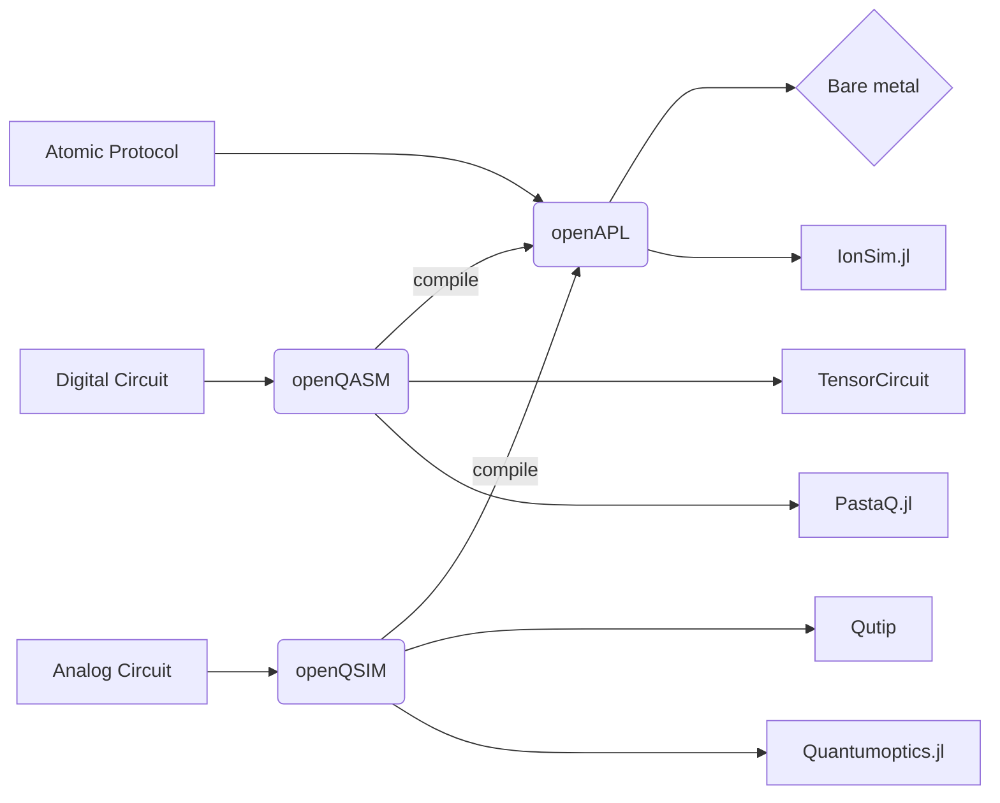

# 

<h2 align="center">
    Program the world's first open-source, full-stack quantum computer.
</h2>

[](https://github.com/ambv/black)

[](https://github.com/OpenQuantumDesign/midstack/actions/workflows/CI.yml)

## What's here

- [Quick Start](#quickstart) <br/>
- [Installation](#installation) <br/>
- [The Stack](#stack) <br/>
- [Documentation](#documentation) <br/>

## Quick start

## Installation <a name="installation"></a>

First install the OQD compiler infrastructure with:

```bash
pip install git+https://github.com/OpenQuantumDesign/compiler_infrastructure.git
```

then:

```bash
pip install git+https://github.com/OpenQuantumDesign/midstack.git
```

Or clone the repository locally and install with:

```bash
git clone https://github.com/OpenQuantumDesign/midstack
pip install .
```

## Getting Started <a name="Getting Started"></a>

To get started you can run one of the example scripts provided. For example, to run the 3 qubit GHz state protocol you can run:

```python
import matplotlib.pyplot as plt

from midstack.interface.analog.operator import *
from midstack.interface.analog.operations import *
from midstack.backend.metric import *
from midstack.backend.task import Task, TaskArgsAnalog
from midstack.backend import QutipBackend

X = PauliX()
Z = PauliZ()

Hx = AnalogGate(hamiltonian=X)

circuit = AnalogCircuit()
circuit.evolve(duration=10, gate=Hx)

args = TaskArgsAnalog(
    n_shots=100,
    fock_cutoff=4,
    metrics={"Z": Expectation(operator=Z)},
    dt=1e-3,
)

task = Task(program=circuit, args=args)

backend = QutipBackend()
experiment = backend.compile(task=task)
results = backend.run(experiment=experiment)

plt.plot(results.times, results.metrics["Z"], label=f"$\\langle Z \\rangle$")
```

## The stack <a name="stack"></a>



### Interfaces <a name="frontends"></a>

Python packages for each layer of the stack.

### Intermediate representations <a name="intermediate-representations"></a>

Expressed with [Pydantic](https://docs.pydantic.dev/latest/).

#### Software <a name="software"></a>

Planned supported software backends include:

- Digital Circuit
  - [Tensor Circuit](https://github.com/tencent-quantum-lab/tensorcircuit)
  - [Yao](https://yaoquantum.org/)
- Analog Circuit
  - [Qutip](https://qutip.org/)
  - [QuantumOptics.jl](https://docs.qojulia.org/search/?q=calcium)
- Trapped-ion Physics Simulator
  - [IonSim.jl](https://www.ionsim.org/)

#### Hardware <a name="hardware"></a>

Planned supported hardware backends include:

- [Quantum Information with Trapped-ions (QITI Lab)](https://qiti.iqc.uwaterloo.ca/publications/) Blade Trap $\left( ^{171}\mathrm{Yb}^+ \right)$
- [QuantumIon](https://tqt.uwaterloo.ca/project-details/quantumion-an-open-access-quantum-computing-platform/) $\left( ^{138}\mathrm{Ba}^+ \right)$

## Documentation <a name="documentation"></a>

Documentation is implemented with [MkDocs](https://www.mkdocs.org/) and can be read from the [docs](https://github.com/OpenQuantumDesign/midstack/tree/main/docs) folder.

To install the dependencies for documentation, run:

```
pip install -e ".[docs]"
```

To deploy the documentation server locally:

```
cp -r examples/ docs/examples/
mkdocs serve
```

After deployment, the documentation can be accessed from http://127.0.0.1:8000
