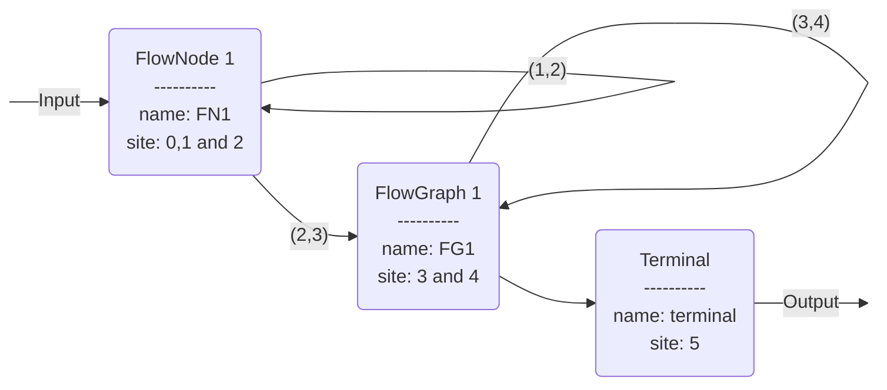

# Compilation

## Visitor

## Flow

### Examples
=== "FlowNode"
    ```mermaid
    flowchart LR

    START:::hidden -- Input --> node(FlowNode) -- Output --> END:::hidden
    node -. Emission .-> MID:::hidden
    classDef hidden display: none;
    ```

=== "FlowGraph"
    === "Only FlowNodes"
        ```mermaid
        flowchart LR
        
        START:::hidden -- Input --> node1(FlowNode 1) --> change1{Change} -- no --> node2(FlowNode 2) --> terminal(Terminal) -- Output --> END:::hidden

        change1 -- yes --> node1

        node1 -. Emission .-> MID1:::hidden
        node2 -. Emission .-> MID2:::hidden
    
        classDef hidden display:none;
        ```
    === "In General"
        ```mermaid
        flowchart LR

        START:::hidden -- Input --> node1(FlowNode 1) --> change1{Change} -- no --> graph1{{"FlowGraph1<br/>(See below)"}} --> change2{Change} -- no --> terminal2(Terminal) -- Output --> END:::hidden

        change1 -- yes --> node1
        change2 -- yes --> graph1

        node1 -. Emission .-> MID1:::hidden

        classDef hidden display: none;
        ```

        ```mermaid
        flowchart LR

        subgraph graph1 [FlowGraph1]
        direction LR
        START:::hidden -- Input --> node2(FlowNode 2) --> change2{Change} -- no --> node3(FlowNode 3) --> terminal(Terminal) -- Output --> END:::hidden

        change2 -- yes --> node4(FlowNode 4) --> change4{Change} -- no --> node2
        change4 -- yes --> node4

        node2 -. Emission .-> MID2:::hidden
        node3 -. Emission .-> MID3:::hidden
        node4 -. Emission .-> MID4:::hidden
        end

        classDef hidden display: none;
        ```

### Forward Decorators
=== "Forward Once"
    ```python linenums="1"
    @ForwardDecorator.forward_once
    def forward_FN1(self, model):
        return dict(done="FN2")
    ```
    ```mermaid
    flowchart LR
    
    node1("FlowNode1<br/>----------<br/>name: FN1")
    node2("FlowNode2<br/>----------<br/>name: FN2")

    
    START:::hidden -- Input --> node1 --> node2 -- continue --> END:::hidden

    node1 -. Emission .-> MID1:::hidden

    classDef hidden display: none;
    ```
=== "Forward Fixed Point"
    ```python linenums="1"
    @ForwardDecorator.forward_fixed_point
    def forward_FN1(self, model):
        return dict(done="FN2")
    ```
    ```mermaid
    flowchart LR
    
    node1("FlowNode1<br/>----------<br/>name: FN1")
    node2("FlowNode2<br/>----------<br/>name: FN2")

    
    START:::hidden -- Input --> node1 --> change1{Change} -- no --> node2 -- continue --> END:::hidden
    
    change1 -- yes --> node1

    node1 -. Emission .-> MID1:::hidden

    classDef hidden display: none;
    ```
=== "Forward Detour"
    ```python linenums="1"
    @ForwardDecorator.forward_detour
    def forward_FN1(self, model):
        return dict(done="FN2", detour="FN3")
    ```
    ```mermaid
    flowchart LR
    
    node1("FlowNode1<br/>----------<br/>name: FN1")
    node2("FlowNode2<br/>----------<br/>name: FN2")
    node3("FlowNode3<br/>----------<br/>name: FN3")


    START:::hidden -- Input --> node1 --> change1{Change} -- no --> node2 -- continue --> END:::hidden
    
    change1 -- yes --> node3 -- continue --> END2:::hidden

    node1 -. Emission .-> MID1:::hidden

    classDef hidden display: none;
    ```

### Traversal

The Traversal records each site it passes through as a TraversalSite:

```python linenums="1" 
traversal.sites[0] = TraversalSite(
    iteration=0, node="FN1", subtraversal=None, emission=...
)
traversal.sites[1] = TraversalSite(
    iteration=1, node="FN1", subtraversal=None, emission=...
)
...
traversal.sites[3] = TraversalSite(
    iteration=1, node="FG1", subtraversal=Traversal(...), emission=None
)
...
travelsal.sites[5] = TraversalSite(
    iteration=5, node="terminal", subtraversal=None, emission=None
)
```