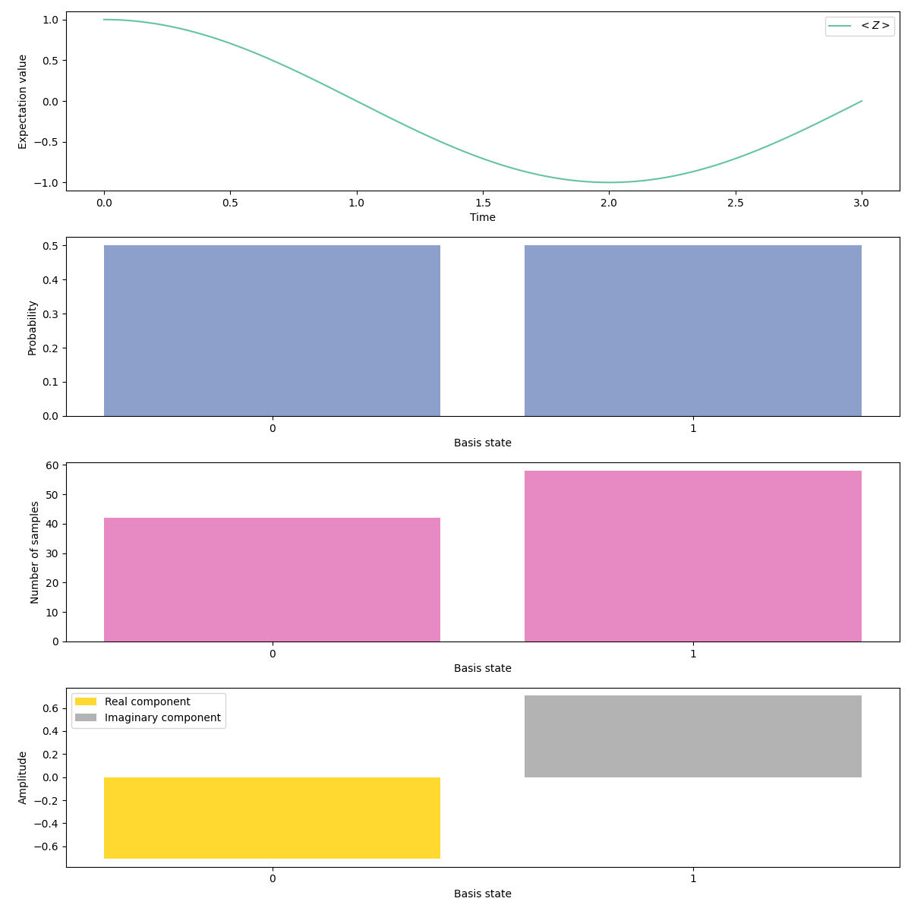

# Single qubit Rabi flopping

Let's implement the single qubit Rabi Flopping,
$$
H = -\frac{\pi}{4}\sigma^x
$$

## Implementation
We will go through this step by step. First we get the necessary imports:
/// details | Imports
``` py
from rich import print as pprint

import numpy as np

from quantumion.interface.analog.operator import *
from quantumion.interface.analog.operations import *
from quantumion.backend.metric import *
from quantumion.backend.task import Task, TaskArgsAnalog
from quantumion.backend import QutipBackend

from examples.emulation.utils import plot_metrics_counts
```
///

Then we define the [`AnalogGate`][quantumion.interface.analog.operations.AnalogGate] object

``` py
"""For simplicity we initialize the X Operator"""
X = PauliX()
    
H = AnalogGate(hamiltonian= -(np.pi / 4) * X)
```

Then we define the [`AnalogCircuit`][quantumion.interface.analog.operations.AnalogCircuit] object and evolve it according to the hamiltonian defined above

``` py
ac = AnalogCircuit()
ac.evolve(duration=3, gate=H)
```

For QuTip simulation we need to define the arguements which contain the number of shots and the metrics we want to evaluate.
``` py
args = TaskArgsAnalog(
    n_shots=100,
    fock_cutoff=4,
    metrics={
        "Z": Expectation(operator = Z),
    },
    dt=1e-3,
)
```

We can then wrap the [`AnalogCircuit`][quantumion.interface.analog.operations.AnalogCircuit] and the args to a `Task` object and run using the QuTip backend. Note that there are 2 ways to run and the 2 ways are explained.

## Running the simulation
=== "Compile & Simulate"
    The `Task` can be compiled first to a [`QutipExperiment`][quantumion.backend.qutip.interface.QutipExperiment] object and then this [`QutipExperiment`][quantumion.backend.qutip.interface.QutipExperiment] object can be run. This is to allow you to see what parameters are used to specify the particular QuTip experiment.

    ``` py
    backend = QutipBackend()
    experiment = backend.compile(task = task)
    results = backend.run(experiment = experiment)
    ```

=== "Directly Simulate"
    The `Task` object can be directly simulated by the `run()` method. 

    ``` py
    backend = QutipBackend()
    results = backend.run(task = task)
    ```

## Results

Finally we can plot the metrics and relevant statistics from the final quantum state:


``` py
plot_metrics_counts(results = results, experiment_name = 'one-qubit-rabi-flopping.png')
```

The generated image is like:

<!--   -->


 
