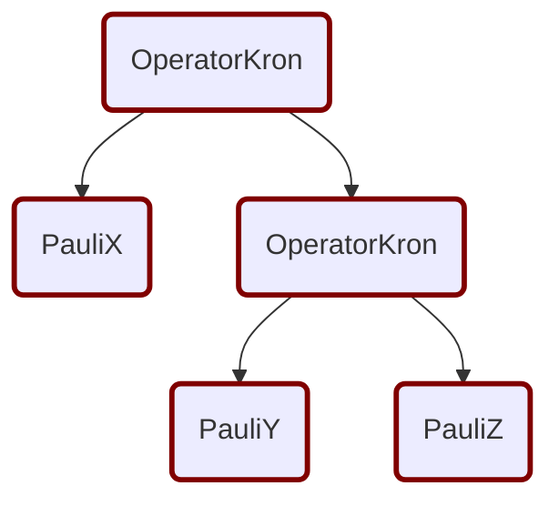
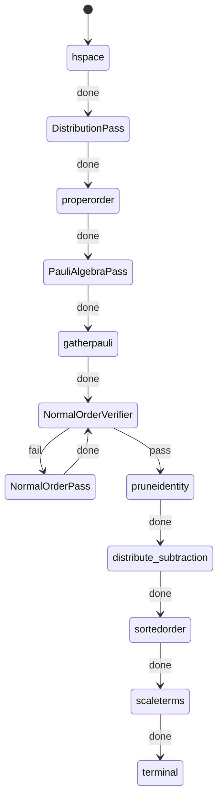
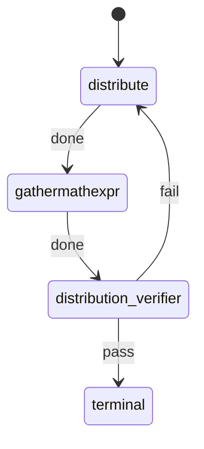
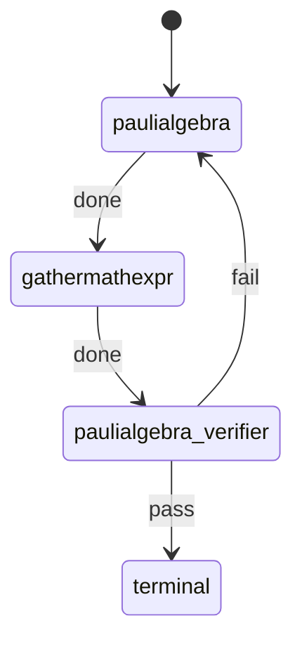
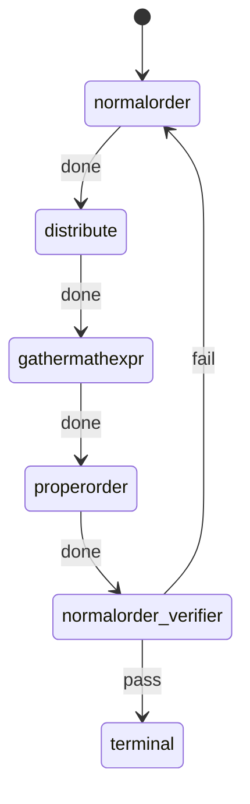

Canonicalization is used to remove redundancy in the representation of a program.

Consider the following two Hamiltonians:

$$
H_{1} = X \otimes I + I \otimes X
$$

$$
H_{2} = I \otimes X + X \otimes I
$$

$H_{1}$ is equivalent to $H_{2}$. Hence we convert the operators to a canonical form and the canonical form of the above operator is:

$$
H_{c} = 1\cdot(I \otimes X) + 1\cdot(X \otimes I)
$$

These canonicalization steps (e.g. distribution) are done by implementing a `RewritesRule` with the corresponding logic.

## Canonicalization Rules

### Distribution

[`Distribution`][oqd_core.compiler.analog.rewrite.canonicalize.OperatorDistribute] distributes the multiplication, scalar multiplication and tensor product of operators over the addition of operators.

<!-- prettier-ignore -->
/// admonition | Example
    type: example

$$X \otimes (Y + Z) \longrightarrow X \otimes Y + X \otimes Z$$

//// tab | Original Graph

////

//// tab | Transformed Graph

////
///

### Gather Math Expression

[`GatherMath`][oqd_core.compiler.analog.rewrite.canonicalize.GatherMathExpr] centralizes the coefficients of the operators by gathering them.

<!-- prettier-ignore -->
/// admonition | Example
    type: example

$$ X \times 3 \times I \longrightarrow 3 \times (X \times I)$$
//// tab | Original Graph

////

//// tab | Transformed Graph

////
///

### Proper Order

[`ProperOrder`][oqd_core.compiler.analog.rewrite.canonicalize.ProperOrder] takes a chain of OperatorMul or a chain of OperatorAdd and puts the operation order from left to right.

<!-- prettier-ignore -->
/// admonition | Example
    type: example

$$ X \otimes (Y \otimes Z) \longrightarrow (X \otimes Y) \otimes Z $$

//// tab | Original Graph

////

//// tab | Transformed Graph

////
///

### Pauli Algebra

[`PauliAlgebra`][oqd_core.compiler.analog.rewrite.canonicalize.PauliAlgebra] applies the Pauli algebra to simplify the operator.

<!-- prettier-ignore -->
/// admonition | Example
    type: example

$$ X \times Y + I \times I \longrightarrow iZ + I $$
//// tab | Original Graph

////

//// tab | Transformed Graph

////
///

### Normal Order

[`NormalOrder`][oqd_core.compiler.analog.rewrite.canonicalize.NormalOrder] puts the ladder operators into normal order.

<!-- prettier-ignore -->
/// admonition | Example
    type: example

$$ C \times A + A \times C \longrightarrow C \times A + C \times A + J$$
//// tab | Original Graph

////

//// tab | Transformed Graph

////
///

### Prune Identity

[`PruneIdentity`][oqd_core.compiler.analog.rewrite.canonicalize.PruneIdentity] prunes the unnecessary ladder identities from the graph.

<!-- prettier-ignore -->
/// admonition | Example
    type: example

$$ C\times A \times J\longrightarrow C \times A$$
//// tab | Original Graph

////

//// tab | Transformed Graph

////
///

### Sorted Order

[`SortedOrder`][oqd_core.compiler.analog.rewrite.canonicalize.SortedOrder] sorts the addition terms in operators into a predefined order.

<!-- prettier-ignore -->
/// admonition | Example
    type: example

$$ X \otimes I + I \otimes X \longrightarrow I \otimes X + X \otimes I$$
//// tab | Original Graph

////

//// tab | Transformed Graph

////
///

### Scale Terms

[`ScaleTerms`][oqd_core.compiler.analog.rewrite.canonicalize.ScaleTerms] introduces scalar multiplication to terms without a coefficient for a more consistent reprensentation.

<!-- prettier-ignore -->
/// admonition | Example
    type: example

$$ I \otimes X + X \otimes I \longrightarrow 1*(I \otimes X) + 1*(X \otimes I)$$
//// tab | Original Graph

////

//// tab | Transformed Graph

////

///

## Canonicalization Pass

The subgraphs defined above are:
/// tab | DistributionPass

///
/// tab | PauliAlgebraPass

///
/// tab | NormalOrderPass

///
