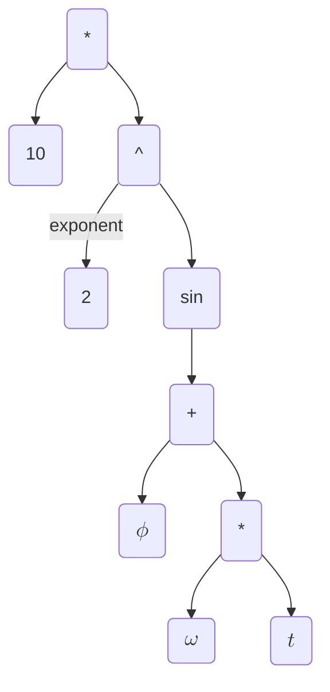

The math interface is utilized to specify arbitrary profiles for operands of the instructions in other interfaces.

The abstract syntax tree of the math interface is implemented by [`MathExpr`][oqd_core.interface.math.MathExpr].

Consider the following math expression:

$$
10 \sin^2(\omega t + \phi)
$$

The corresponding [`MathExpr`][oqd_core.interface.math.MathExpr] has the following structure:

## Terminals

The terminals of the math interface consist of:

/// tab | `MathNum`
[`MathNum`][oqd_core.interface.math.MathNum] represents a number.

<!-- prettier-ignore -->
/// admonition | Note
    type: note
Numbers are considered to belong to the real numbers, i.e. they can be positive or negative floats.
///
///

/// tab | `MathImag`
[`MathImag`][oqd_core.interface.math.MathImag] represents the imaginary unit.
///

/// tab | `MathVar`
[`MathVar`][oqd_core.interface.math.MathVar] represents a protected named variable to be substituted during compile time or runtime.
///

## Operators

The compatible operators for the math interface consist of:

/// tab | `MathAdd`

//// html | div

////

[`MathAdd`][oqd_core.interface.math.MathAdd] represents an addition of two expressions.
///

/// tab | `MathMul`

//// html | div

////

[`MathMul`][oqd_core.interface.math.MathMul] represents an multiplication of two expressions.
///

/// tab | `MathPow`

//// html | div

////

[`MathPow`][oqd_core.interface.math.MathPow] represents an exponentiation of an expression with the other expression.
///

/// tab | `MathSub`

//// html | div

////

[`MathSub`][oqd_core.interface.math.MathSub] represents an subtraction of two expressions.
///

/// tab | `MathDiv`

//// html | div

////

[`MathDiv`][oqd_core.interface.math.MathDiv] represents an division of two expressions.
///

/// tab | `MathFunc`

//// html | div

////

[`MathFunc`][oqd_core.interface.math.MathFunc] represents the application of a named function on an expression.

The compatible named functions include:

- trigonometric (`sin`, `cos`, `tan`)
- hyperbolic trigonometric (`sinh`, `cosh`, `tanh`)
- exponential (`exp`)
- logarithm (`log`)

///
