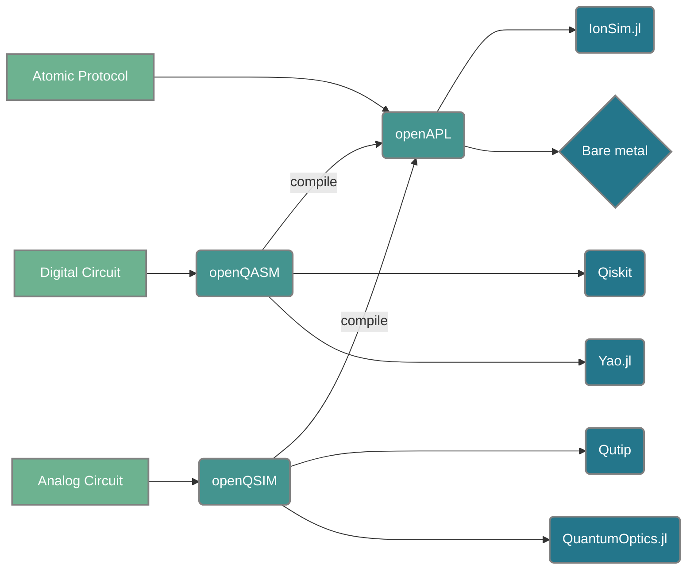

# 

    <h2 align="center">
        Program the world's first open-source, full-stack quantum computer.
    </h2>

!!! note
    Welcome to the Open Quantum Design framework for programming quantum computers. 
    This documentation is still under development, please feel to contribute! © Open Quantum Design

## The stack

