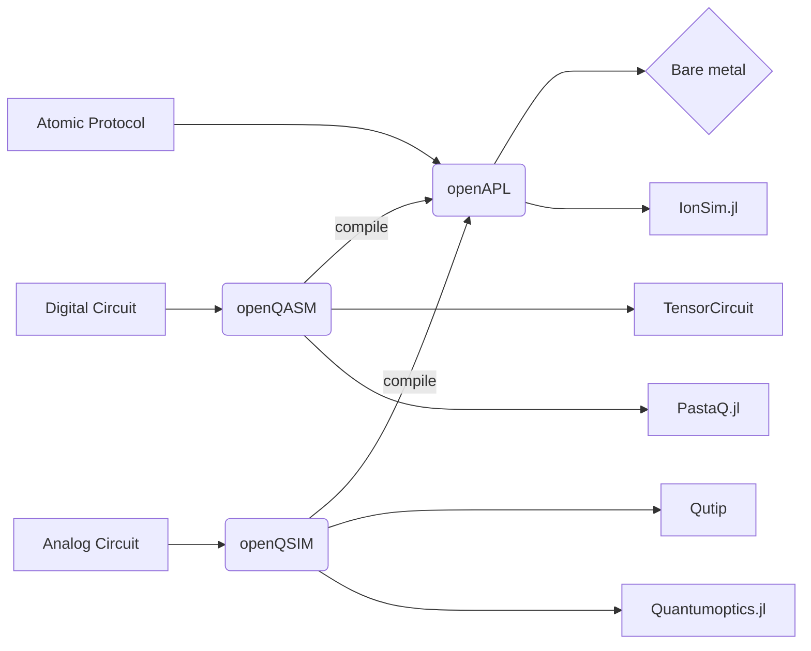

# Welcome to Open Quantum Design
!!! note
    Welcome to the Open Quantum Design frameowkr for programming quantum computers. 
    This documentation is still under development, please feel to contribute! © Open Quantum Design

# 

## The stack

[//]: # ()