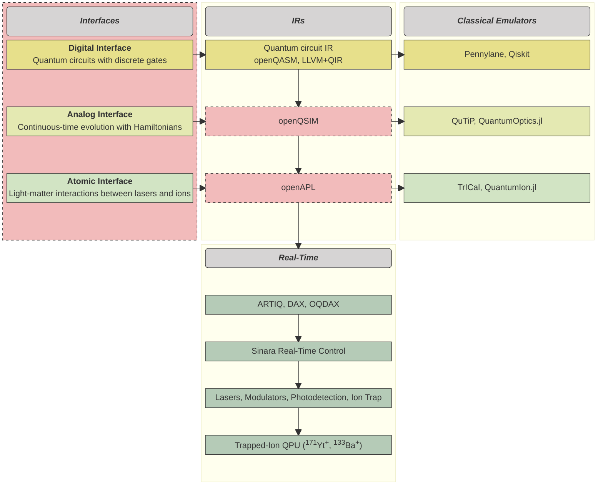

# 

    <h2 align="center">
    Open Quantum Design: Core
    </h2>

<!-- prettier-ignore -->
/// admonition | Note
    type: note
Welcome to Open Quantum Design.
This documentation is still under development, we welcome contributions! © Open Quantum Design
///

### Where in the stack

The stack components highlighted in red are contained in this repository.