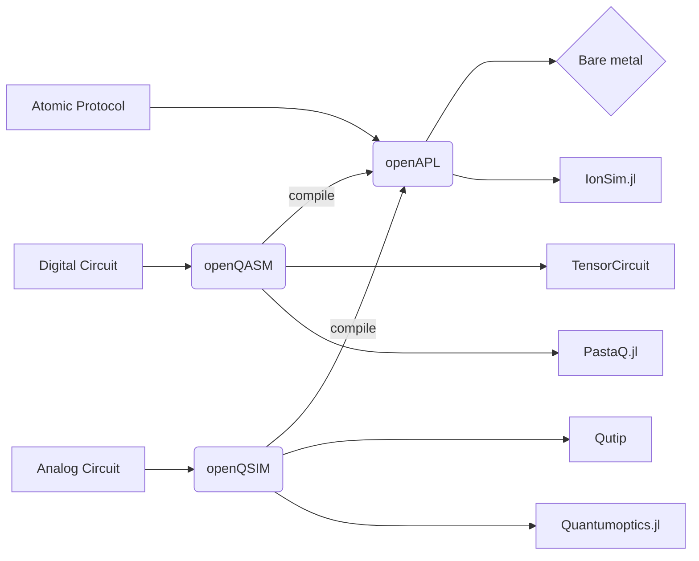

# Welcome to Open Quantum Design
!!! note
    Welcome to the Open Quantum Design frameowkr for programming quantum computers. 
    This documentation is still under development, please feel to contribute! © Open Quantum Design

## Contents
1. [Tutorials](tutorials.md)
2. [How-To Guides](how-to-guides.md)
3. [Reference](reference.md)
4. [Explanation](explanation.md)

## The stack
    

