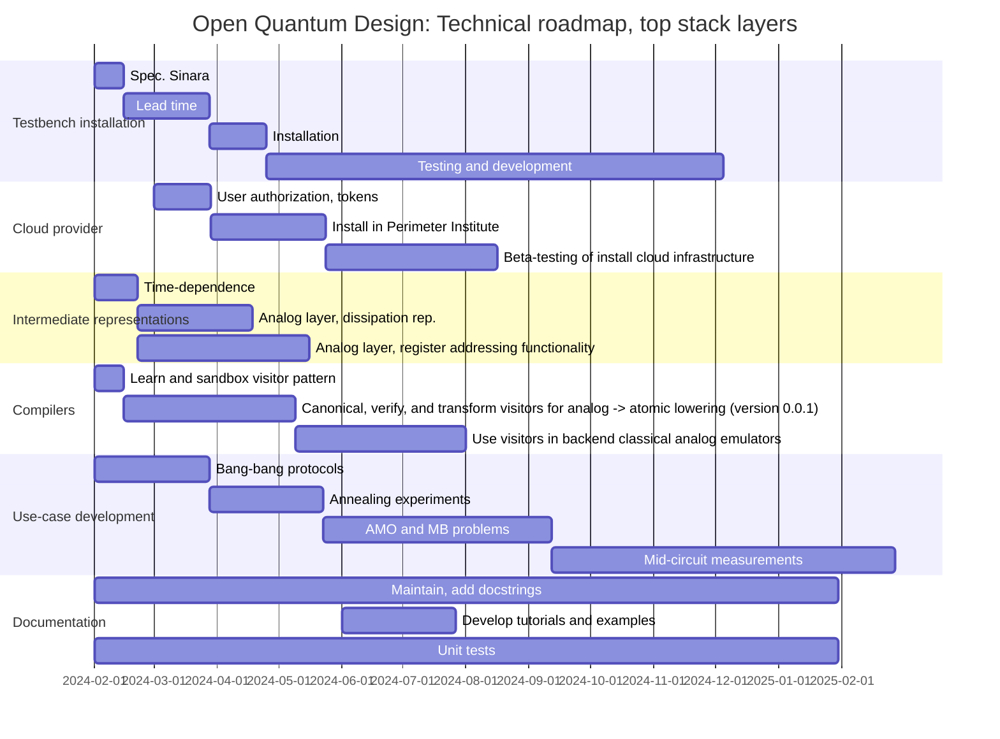

## Technical milestones for top-layer stack components
1. Spec and source Sinara system for testbench (clone of QuantumION control stack).
2. Cloud provider with authentication, queueing, and multiple classical emulators.
3. Fix analog and atomic IR specifications at version 0.1.
4. Develop initial compiler infrastructure to lower analog -> atomic, atomic -> DAX/ARTIQ.
5. Express monitored quantum circuit in IRs, run with classical emulation.
6. Evaluate prototype programs on testbench Sinara hardware.
7. Good documentation and unit tests.

