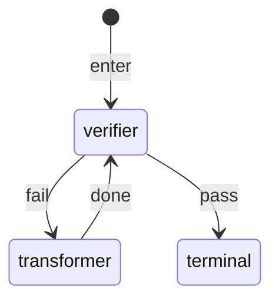
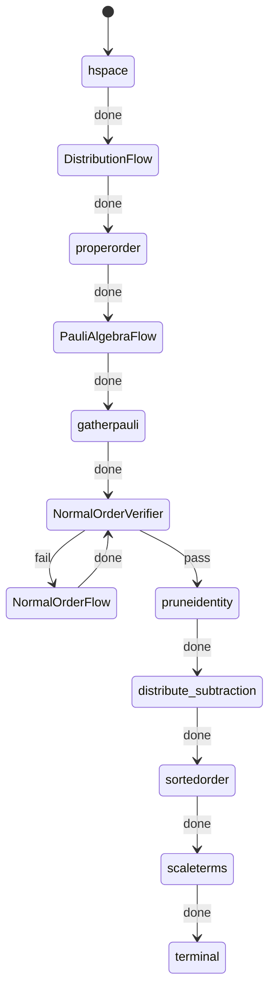

# Visitor pattern and compilation
So far we have been working on Canonicalization using Visitor pattern. First let's see how we represent objects in our syntax.

## Abstract Syntax Tree for Operators

We represent `Operator` as trees like:
!!! Operator

    In our language we represent all operators as abstract syntax trees. this the operator 
    ``` PauliX() @ PauliX()``` 
    would be reprsented as the tree:
    ```mermaid
    graph TD;
        A[@] --> B["PauliX()"]
        A --> C["PauliX()"]
    ```

In Canonicalization we ensure that for operators:
$$
H_{1} = X \otimes I + I \otimes X
$$
$$
H_{2} = I \otimes X + X \otimes I 
$$
$H_{1}$ is equivalent to $H_{2}$. Hence we convert the operators to a canonical form and the canonical form of the above operator is:
$$
H_{c} = 1\cdot(I \otimes X) + 1\cdot(X \otimes I)
$$

These canonicalization steps are done using `Visitors` and `Transformers`. For every kind of canonicalization operation (like for example `distribution`) we define a graph like:




Now we describe all the visitors and transformers we have.

## Visitors and Transformers
### Distribution

This distributes oeprators and an example can be the conversion: 

$$X \otimes (Y + Z) \longrightarrow X \otimes Y + X \otimes Z$$

=== "Original Graph"
    ```mermaid
    graph TD
    element0("PauliX"):::Pauli
    element1("PauliY"):::Pauli
    element2("PauliZ"):::Pauli
    element3("OperatorAdd"):::OperatorAdd
    element3 --> element1 & element2
    element4("OperatorKron"):::OperatorKron
    element4 --> element0 & element3
    classDef Pauli stroke:#800000,stroke-width:3px
    classDef Ladder stroke:#800000,stroke-width:3px
    classDef OperatorAdd stroke:#800000,stroke-width:3px
    classDef OperatorScalarMul stroke:#800000,stroke-width:3px
    classDef OperatorKron stroke:#800000,stroke-width:3px
    classDef OperatorMul stroke:#800000,stroke-width:3px
    classDef MathExpr stroke:#800000,stroke-width:3px
    ```

=== "Transformed Graph"
    ```mermaid
    graph TD
    element0("PauliX"):::Pauli
    element1("PauliY"):::Pauli
    element2("OperatorKron"):::OperatorKron
    element2 --> element0 & element1
    element3("PauliX"):::Pauli
    element4("PauliZ"):::Pauli
    element5("OperatorKron"):::OperatorKron
    element5 --> element3 & element4
    element6("OperatorAdd"):::OperatorAdd
    element6 --> element2 & element5
    classDef Pauli stroke:#800000,stroke-width:3px
    classDef Ladder stroke:#800000,stroke-width:3px
    classDef OperatorAdd stroke:#800000,stroke-width:3px
    classDef OperatorScalarMul stroke:#800000,stroke-width:3px
    classDef OperatorKron stroke:#800000,stroke-width:3px
    classDef OperatorMul stroke:#800000,stroke-width:3px
    classDef MathExpr stroke:#800000,stroke-width:3px
    ```
### Gather Math Expression

This gathers math expressions of oprators and an example can be the conversion: 

$$ X \times 3 \times I \longrightarrow 3 \times (X \times Y)$$
=== "Original Graph"
    ```mermaid
    graph TD
    element0("MathExpr<br/>--------<br/>expr = #quot;3#quot;"):::MathExpr
    element1("PauliX"):::Pauli
    element2("OperatorScalarMul"):::OperatorScalarMul
    element2 --> element0 & element1
    element3("PauliI"):::Pauli
    element4("OperatorMul"):::OperatorMul
    element4 --> element2 & element3
    classDef Pauli stroke:#800000,stroke-width:3px
    classDef Ladder stroke:#800000,stroke-width:3px
    classDef OperatorAdd stroke:#800000,stroke-width:3px
    classDef OperatorScalarMul stroke:#800000,stroke-width:3px
    classDef OperatorKron stroke:#800000,stroke-width:3px
    classDef OperatorMul stroke:#800000,stroke-width:3px
    classDef MathExpr stroke:#800000,stroke-width:3px
    ```


=== "Transformed Graph"
    ```mermaid
    graph TD
    element0("MathExpr<br/>--------<br/>expr = #quot;3#quot;"):::MathExpr
    element1("PauliX"):::Pauli
    element2("PauliI"):::Pauli
    element3("OperatorMul"):::OperatorMul
    element3 --> element1 & element2
    element4("OperatorScalarMul"):::OperatorScalarMul
    element4 --> element0 & element3
    classDef Pauli stroke:#800000,stroke-width:3px
    classDef Ladder stroke:#800000,stroke-width:3px
    classDef OperatorAdd stroke:#800000,stroke-width:3px
    classDef OperatorScalarMul stroke:#800000,stroke-width:3px
    classDef OperatorKron stroke:#800000,stroke-width:3px
    classDef OperatorMul stroke:#800000,stroke-width:3px
    classDef MathExpr stroke:#800000,stroke-width:3px
    ```


### Proper Order

This converts the operator to a proper order like: 

$$  X \otimes (Y \otimes Z) \longrightarrow (X \otimes Y) \otimes Z $$
=== "Original Graph"
    ```mermaid
    graph TD
    element0("PauliX"):::Pauli
    element1("PauliY"):::Pauli
    element2("PauliZ"):::Pauli
    element3("OperatorKron"):::OperatorKron
    element3 --> element1 & element2
    element4("OperatorKron"):::OperatorKron
    element4 --> element0 & element3
    classDef Pauli stroke:#800000,stroke-width:3px
    classDef Ladder stroke:#800000,stroke-width:3px
    classDef OperatorAdd stroke:#800000,stroke-width:3px
    classDef OperatorScalarMul stroke:#800000,stroke-width:3px
    classDef OperatorKron stroke:#800000,stroke-width:3px
    classDef OperatorMul stroke:#800000,stroke-width:3px
    classDef MathExpr stroke:#800000,stroke-width:3px
    ```


=== "Transformed Graph"
    ```mermaid
    graph TD
    element0("PauliX"):::Pauli
    element1("PauliY"):::Pauli
    element2("OperatorKron"):::OperatorKron
    element2 --> element0 & element1
    element3("PauliZ"):::Pauli
    element4("OperatorKron"):::OperatorKron
    element4 --> element2 & element3
    classDef Pauli stroke:#800000,stroke-width:3px
    classDef Ladder stroke:#800000,stroke-width:3px
    classDef OperatorAdd stroke:#800000,stroke-width:3px
    classDef OperatorScalarMul stroke:#800000,stroke-width:3px
    classDef OperatorKron stroke:#800000,stroke-width:3px
    classDef OperatorMul stroke:#800000,stroke-width:3px
    classDef MathExpr stroke:#800000,stroke-width:3px
    ```

### Pauli Algebra

This converts the operator to a proper order like: 

$$  X \times Y + I \times I  \longrightarrow iZ + I $$
=== "Original Graph"
    ```mermaid
    graph TD
    element0("PauliX"):::Pauli
    element1("PauliY"):::Pauli
    element2("OperatorMul"):::OperatorMul
    element2 --> element0 & element1
    element3("PauliI"):::Pauli
    element4("PauliI"):::Pauli
    element5("OperatorMul"):::OperatorMul
    element5 --> element3 & element4
    element6("OperatorAdd"):::OperatorAdd
    element6 --> element2 & element5
    classDef Pauli stroke:#800000,stroke-width:3px
    classDef Ladder stroke:#800000,stroke-width:3px
    classDef OperatorAdd stroke:#800000,stroke-width:3px
    classDef OperatorScalarMul stroke:#800000,stroke-width:3px
    classDef OperatorKron stroke:#800000,stroke-width:3px
    classDef OperatorMul stroke:#800000,stroke-width:3px
    classDef MathExpr stroke:#800000,stroke-width:3px
    ```

=== "Transformed Graph"
    ```mermaid
    graph TD
    element0("MathExpr<br/>--------<br/>expr = #quot;1j#quot;"):::MathExpr
    element1("PauliZ"):::Pauli
    element2("OperatorScalarMul"):::OperatorScalarMul
    element2 --> element0 & element1
    element3("PauliI"):::Pauli
    element4("OperatorAdd"):::OperatorAdd
    element4 --> element2 & element3
    classDef Pauli stroke:#800000,stroke-width:3px
    classDef Ladder stroke:#800000,stroke-width:3px
    classDef OperatorAdd stroke:#800000,stroke-width:3px
    classDef OperatorScalarMul stroke:#800000,stroke-width:3px
    classDef OperatorKron stroke:#800000,stroke-width:3px
    classDef OperatorMul stroke:#800000,stroke-width:3px
    classDef MathExpr stroke:#800000,stroke-width:3px
    ```

### Normal Order

This converts the operator to the Normal order form like: 

$$  C \times A + A \times C  \longrightarrow  C \times A + C \times A +  J$$
=== "Original Graph"
    ```mermaid
    graph TD
    element0("Creation"):::Ladder
    element1("Annihilation"):::Ladder
    element2("OperatorMul"):::OperatorMul
    element2 --> element0 & element1
    element3("Annihilation"):::Ladder
    element4("Creation"):::Ladder
    element5("OperatorMul"):::OperatorMul
    element5 --> element3 & element4
    element6("OperatorAdd"):::OperatorAdd
    element6 --> element2 & element5
    classDef Pauli stroke:#800000,stroke-width:3px
    classDef Ladder stroke:#800000,stroke-width:3px
    classDef OperatorAdd stroke:#800000,stroke-width:3px
    classDef OperatorScalarMul stroke:#800000,stroke-width:3px
    classDef OperatorKron stroke:#800000,stroke-width:3px
    classDef OperatorMul stroke:#800000,stroke-width:3px
    classDef MathExpr stroke:#800000,stroke-width:3px
    ```

=== "Transformed Graph"
    ```mermaid
    graph TD
    element0("Creation"):::Ladder
    element1("Annihilation"):::Ladder
    element2("OperatorMul"):::OperatorMul
    element2 --> element0 & element1
    element3("Creation"):::Ladder
    element4("Annihilation"):::Ladder
    element5("OperatorMul"):::OperatorMul
    element5 --> element3 & element4
    element6("Identity"):::Ladder
    element7("OperatorAdd"):::OperatorAdd
    element7 --> element5 & element6
    element8("OperatorAdd"):::OperatorAdd
    element8 --> element2 & element7
    classDef Pauli stroke:#800000,stroke-width:3px
    classDef Ladder stroke:#800000,stroke-width:3px
    classDef OperatorAdd stroke:#800000,stroke-width:3px
    classDef OperatorScalarMul stroke:#800000,stroke-width:3px
    classDef OperatorKron stroke:#800000,stroke-width:3px
    classDef OperatorMul stroke:#800000,stroke-width:3px
    classDef MathExpr stroke:#800000,stroke-width:3px
    ```

### Prune Identity

This removed unnecessary Identities from the graph. Note that this only affects ladders as identities are already removed from the graph for paulis using pauli algebra.

$$  C\times A \times J\longrightarrow  C \times A$$
=== "Original Graph"
    ```mermaid
    graph TD
    element0("Creation"):::Ladder
    element1("Annihilation"):::Ladder
    element2("OperatorMul"):::OperatorMul
    element2 --> element0 & element1
    element3("Identity"):::Ladder
    element4("OperatorMul"):::OperatorMul
    element4 --> element2 & element3
    classDef Pauli stroke:#800000,stroke-width:3px
    classDef Ladder stroke:#800000,stroke-width:3px
    classDef OperatorAdd stroke:#800000,stroke-width:3px
    classDef OperatorScalarMul stroke:#800000,stroke-width:3px
    classDef OperatorKron stroke:#800000,stroke-width:3px
    classDef OperatorMul stroke:#800000,stroke-width:3px
    classDef MathExpr stroke:#800000,stroke-width:3px
    ```

=== "Transformed Graph"
    ```mermaid
    graph TD
    element0("Creation"):::Ladder
    element1("Annihilation"):::Ladder
    element2("OperatorMul"):::OperatorMul
    element2 --> element0 & element1
    classDef Pauli stroke:#800000,stroke-width:3px
    classDef Ladder stroke:#800000,stroke-width:3px
    classDef OperatorAdd stroke:#800000,stroke-width:3px
    classDef OperatorScalarMul stroke:#800000,stroke-width:3px
    classDef OperatorKron stroke:#800000,stroke-width:3px
    classDef OperatorMul stroke:#800000,stroke-width:3px
    classDef MathExpr stroke:#800000,stroke-width:3px
    ```


### Sorted Order

This sorts the terms in addition like:


$$  X \otimes I + I \otimes X \longrightarrow I \otimes X + X \otimes I$$
=== "Original Graph"
    ```mermaid
    graph TD
    element0("PauliX"):::Pauli
    element1("PauliI"):::Pauli
    element2("OperatorKron"):::OperatorKron
    element2 --> element0 & element1
    element3("PauliI"):::Pauli
    element4("PauliX"):::Pauli
    element5("OperatorKron"):::OperatorKron
    element5 --> element3 & element4
    element6("OperatorAdd"):::OperatorAdd
    element6 --> element2 & element5
    classDef Pauli stroke:#800000,stroke-width:3px
    classDef Ladder stroke:#800000,stroke-width:3px
    classDef OperatorAdd stroke:#800000,stroke-width:3px
    classDef OperatorScalarMul stroke:#800000,stroke-width:3px
    classDef OperatorKron stroke:#800000,stroke-width:3px
    classDef OperatorMul stroke:#800000,stroke-width:3px
    classDef MathExpr stroke:#800000,stroke-width:3px
    ```
=== "Transformed Graph"
    ```mermaid
    graph TD
    element0("PauliI"):::Pauli
    element1("PauliX"):::Pauli
    element2("OperatorKron"):::OperatorKron
    element2 --> element0 & element1
    element3("PauliX"):::Pauli
    element4("PauliI"):::Pauli
    element5("OperatorKron"):::OperatorKron
    element5 --> element3 & element4
    element6("OperatorAdd"):::OperatorAdd
    element6 --> element2 & element5
    classDef Pauli stroke:#800000,stroke-width:3px
    classDef Ladder stroke:#800000,stroke-width:3px
    classDef OperatorAdd stroke:#800000,stroke-width:3px
    classDef OperatorScalarMul stroke:#800000,stroke-width:3px
    classDef OperatorKron stroke:#800000,stroke-width:3px
    classDef OperatorMul stroke:#800000,stroke-width:3px
    classDef MathExpr stroke:#800000,stroke-width:3px
    ```
### Scale Terms

This just scales the terms in the additions for consistency:


$$  I \otimes X + X \otimes I \longrightarrow 1*(I \otimes X) + 1*(X \otimes I)$$
=== "Original Graph"
    ```mermaid
    graph TD
    element0("PauliI"):::Pauli
    element1("PauliX"):::Pauli
    element2("OperatorKron"):::OperatorKron
    element2 --> element0 & element1
    element3("PauliX"):::Pauli
    element4("PauliI"):::Pauli
    element5("OperatorKron"):::OperatorKron
    element5 --> element3 & element4
    element6("OperatorAdd"):::OperatorAdd
    element6 --> element2 & element5
    classDef Pauli stroke:#800000,stroke-width:3px
    classDef Ladder stroke:#800000,stroke-width:3px
    classDef OperatorAdd stroke:#800000,stroke-width:3px
    classDef OperatorScalarMul stroke:#800000,stroke-width:3px
    classDef OperatorKron stroke:#800000,stroke-width:3px
    classDef OperatorMul stroke:#800000,stroke-width:3px
    classDef MathExpr stroke:#800000,stroke-width:3px
    ```
=== "Transformed Graph"

    ```mermaid
    graph TD
    element0("MathExpr<br/>--------<br/>expr = #quot;1#quot;"):::MathExpr
    element1("PauliI"):::Pauli
    element2("PauliX"):::Pauli
    element3("OperatorKron"):::OperatorKron
    element3 --> element1 & element2
    element4("OperatorScalarMul"):::OperatorScalarMul
    element4 --> element0 & element3
    element5("MathExpr<br/>--------<br/>expr = #quot;1#quot;"):::MathExpr
    element6("PauliX"):::Pauli
    element7("PauliI"):::Pauli
    element8("OperatorKron"):::OperatorKron
    element8 --> element6 & element7
    element9("OperatorScalarMul"):::OperatorScalarMul
    element9 --> element5 & element8
    element10("OperatorAdd"):::OperatorAdd
    element10 --> element4 & element9
    classDef Pauli stroke:#800000,stroke-width:3px
    classDef Ladder stroke:#800000,stroke-width:3px
    classDef OperatorAdd stroke:#800000,stroke-width:3px
    classDef OperatorScalarMul stroke:#800000,stroke-width:3px
    classDef OperatorKron stroke:#800000,stroke-width:3px
    classDef OperatorMul stroke:#800000,stroke-width:3px
    classDef MathExpr stroke:#800000,stroke-width:3px
    ```

## Composition of Visitors

The visitors are composed in a graphical structure. Recall that or every kind of canonicalization operation (like for example `distribution`) we define a graph like:


Hence, using this, we define the full graphical structure as:



The subgraphs defined above are:
=== "DistributionFlow"
    ```mermaid
    stateDiagram-v2

    [*] --> distribute 
    distribute --> gathermathexpr: done
    gathermathexpr --> distribution_verifier: done
    distribution_verifier --> distribute: fail
    distribution_verifier --> terminal: pass
    ```
=== "PauliAlgebraFlow"
    ```mermaid
    stateDiagram-v2

    [*] --> paulialgebra 
    paulialgebra --> gathermathexpr: done
    gathermathexpr --> paulialgebra_verifier: done
    paulialgebra_verifier --> paulialgebra: fail
    paulialgebra_verifier --> terminal: pass
    ```
=== "NormalOrderFlow"
    ```mermaid
    stateDiagram-v2

    [*] --> normalorder 
    normalorder --> distribute: done
    distribute --> gathermathexpr: done
    gathermathexpr --> properorder: done
    properorder --> normalorder_verifier: done
    normalorder_verifier --> normalorder: fail
    normalorder_verifier --> terminal: pass
    ```