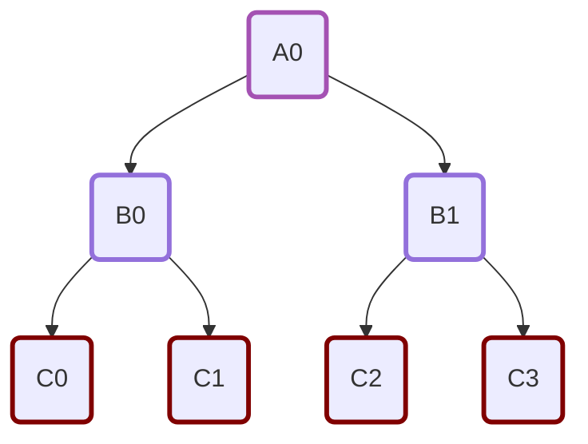
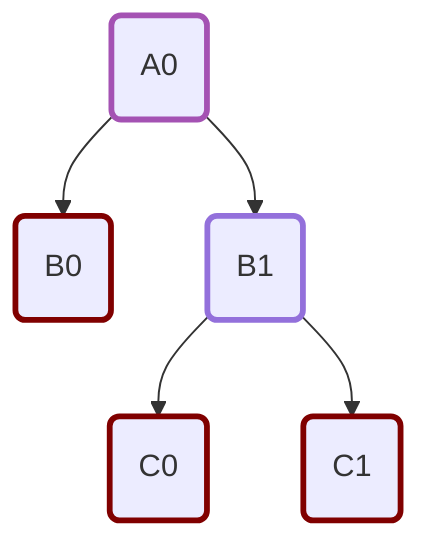

We are using the Visitor patter, but have separated the logic (`Rule`) and IR Traversal (`Walk`) for more flexibility. 

## RewriteRules

Rewrite Rules in compilers are basically used to match and then transform an expression. For example, similifying an expression like `2 * (1 + 3)` to `2 * 1 + 2 * 3` is a form of rewriting the expression. here we demonstrate rewriting with the simple example shown below:
$$
X@(Y*I)\rightarrow X@Y
$$
This rewrite modified the AST as shown below. This Rule is an example of [`PauliAlgebra`][midstack.compiler.analog.rewrite.canonicalize.PauliAlgebra]. Here we basically rewrite the right hand side of the `OperatorKron`.

=== "Original Graph"
    ```mermaid
    graph TD
    element0("PauliX"):::Pauli
    element1("PauliY"):::Pauli
    element2("PauliI"):::Pauli
    element3("OperatorMul"):::OperatorMul
    element3 --> element1 & element2
    element4("OperatorKron"):::OperatorKron
    element4 --> element0 & element3
    classDef Pauli stroke:#800000,stroke-width:3px
    classDef Ladder stroke:#700000,stroke-width:3px
    classDef OperatorAdd stroke:#3495BD,stroke-width:3px
    classDef OperatorScalarMul stroke:#500000,stroke-width:3px
    classDef OperatorKron stroke:#A452B3,stroke-width:3px
    classDef OperatorMul stroke:300000,stroke-width:3px
    classDef MathExpr stroke:#100000,stroke-width:3px
    ```

=== "Transformed Graph after Rewrite"
    ```mermaid
    graph TD
    element0("PauliX"):::Pauli
    element1("PauliY"):::Pauli
    element4("OperatorKron"):::OperatorKron
    element4 --> element0 & element1
    classDef Pauli stroke:#800000,stroke-width:3px
    classDef Ladder stroke:#700000,stroke-width:3px
    classDef OperatorAdd stroke:#3495BD,stroke-width:3px
    classDef OperatorScalarMul stroke:#500000,stroke-width:3px
    classDef OperatorKron stroke:#A452B3,stroke-width:3px
    classDef OperatorMul stroke:300000,stroke-width:3px
    classDef MathExpr stroke:#100000,stroke-width:3px

    ```

Note that `RewriteRule` does not traverse through the graph. To traverse a graph we use `Walk`.

## Walk
Walks are just the different ways of traversing graphs. Example for this case. We have several types of `Walk`. I will show the different types using the following the Tree.


=== "Pre"
    === "Regular"
        $$ A0\rightarrow B0 \rightarrow C0 \rightarrow C1  \rightarrow B1 \rightarrow C2 \rightarrow C3 $$
    === "Reverse"
        $$ A0\rightarrow B1 \rightarrow C3 \rightarrow C2  \rightarrow B0 \rightarrow C1 \rightarrow C0 $$
=== "Post"
    === "Regular"
        $$ C0\rightarrow C1 \rightarrow B0 \rightarrow C2 \rightarrow C3 \rightarrow B1 \rightarrow A0 $$
    === "Reverse"
        $$ C3\rightarrow C2 \rightarrow B1 \rightarrow C1 \rightarrow C0 \rightarrow B0 \rightarrow A0 $$
=== "In"
    === "Regular"
        $$ C0\rightarrow B0 \rightarrow C1 \rightarrow A0 \rightarrow C2 \rightarrow B1 \rightarrow C3 $$
    === "Reverse"
        $$ C3\rightarrow B1 \rightarrow C2 \rightarrow A0 \rightarrow C1 \rightarrow B0 \rightarrow C0 $$
=== "Level"
    === "Regular"
        $$ A0\rightarrow B0 \rightarrow B1 \rightarrow C0 \rightarrow C1 \rightarrow C2 \rightarrow C3 $$
    === "Reverse"
        $$ A0\rightarrow B1 \rightarrow B0 \rightarrow C3 \rightarrow C2 \rightarrow C1 \rightarrow C0 $$

## Conversion Rule

- So far what we have shown is used to rewrite expressions.
- However if we want to go from one IR to another (i.e. lowering) we need to slightly modify the rule and implemented ConversionRule.
- This was inspired by MLIR where we found that they also use rewrite rules for rewriting (i.e. within the same IR) and use Conversion when they want to compile to a different IR.

- Basically we do a post walk, but we store the converted values in a dictionary and then use them as required. Example consider the following graph.



Recall `Post`  walk the order would be 

$$
PostWalk: B0\rightarrow C0 \rightarrow C1 \rightarrow B1 \rightarrow A0
$$

→ at $B0$, the converted value of $B0$ is stored

→ at $C0$, the converted value of $C0$ is stored

→ at $C1$, the converted value of $C1$ is stored

→ at $B1$, the converted value of $B1$ is computed using the converted values of  $C0$ and  $C1$

→ at $A0$, the converted value of $A0$ is computed using the converted values of  $B0$ and  $B1$

### Why we need Conversion Rule?

Here is a simple illustration

```python
# In IR1 we have addition which takes in IR1_Math
>>> IR1add(op1: IR1_Math, 
						op2: IR1_Math)
				
# In IR2 we have addition which takes in IR2_Math
>>> IR2add(op1: IR2_Math, 
						op2: IR2_Math)

# Say we want to go from IR1add to IR2add

# if I do:
def map_IR1add(self, model: IR1add):
	return IR2add(op1 = model.op1, op2 = model.op2) # would not work, as IR2
																									# does not recognize IR1_Math

# Now, this means i need to evaluate the operands of IR1add before
# putting the result in return IR2add(op1 = model.op1, op2 = model.op2)
# This is where Conversion pattern comes in. In conversion pattern 
# we have an additional parameter called operands which pre computes the
# children nodes. In conversion pattern this can be simple done by:

def map_IR1add(self, model: IR1add, operands):
	return IR2add(op1 = operands['op1'], op2 = operands['op2'])

```

## Passes

In compiler terminology going through the whole IR once is called a pass. Now we can combine passes in functions by calling different passes. For example, in our case, the qutip compilation is done by different passes as shown below


```python
    def compile(self, task: Task):
        """
        Method for compiling a task to a [`QutipExperiment`][midstack.backend.qutip.interface.QutipExperiment]

        Args:
            task (Task): Quantum experiment to compile

        Returns:
            QutipExperiment containing the compiled experiment for Qutip
        """
        from midstack.compiler.analog.passes.canonicalize import (
            analog_operator_canonicalization,
        )
        from midstack.compiler.analog.passes.assign import (
            assign_analog_circuit_dim,
            verify_analog_args_dim,
        )
        from midstack.backend.qutip.passes import (
            compiler_analog_args_to_qutipIR,
            compiler_analog_circuit_to_qutipIR,
        )

        # pass to canonicaliza the operators in the AnalogCircuit
        canonicalized_circuit = analog_operator_canonicalization(task.program)
        
        # This just canonicalizes the operators inside the TaskArgsAnalog
        # i.e. operators for Expectation
        canonicalized_args = analog_operator_canonicalization(
            task.args
        )
        
        
				# another pass which assigns the n_qreg and n_qmode of the 
				# AnalogCircuit IR
        assigned_circuit = assign_analog_circuit_dim(canonicalized_circuit)
        
        # This just verifies that the operators in the args have the same
        # dimension as the operators in the AnalogCircuit
        verify_analog_args_dim(
            canonicalized_args,
            n_qreg=assigned_circuit.n_qreg,
            n_qmode=assigned_circuit.n_qmode,
        )
        
        # another pass which compiles AnalogCircuit to a QutipExperiment
        converted_circuit = compiler_analog_circuit_to_qutipIR(
            assigned_circuit, fock_cutoff=task.args.fock_cutoff
        )
        
        # This just converts the args so that the operators of the args are
        # converted to qutip objects
        converted_args = compiler_analog_args_to_qutipIR(canonicalized_args)

        return (
		        # converted_circuit is QutipExperiment defined from the AnalogCircuit
            converted_circuit,
            converted_args,
        )
	      # then you basically run the experiment using the args as 
	      # compiler parameters
```