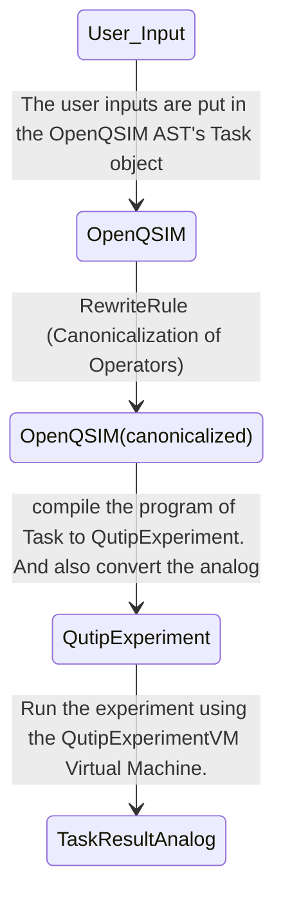

## Compilation

We first compile [`AnalogCircuit`][midstack.interface.analog.operations.AnalogCircuit] to a [`QutipExperiment`][midstack.backend.qutip.interface.QutipExperiment] using the ConversionRule [`QutipBackendCompiler`][midstack.backend.qutip.conversion.QutipBackendCompiler]. We also then separately convert the args of Analog layer to a corresponding representation of the args which can be processed by QuTip. The [`compile`][midstack.backend.qutip.base.QutipBackend.compile] functions is used to compile [`AnalogCircuit`][midstack.interface.analog.operations.AnalogCircuit] to a [`QutipExperiment`][midstack.backend.qutip.interface.QutipExperiment] and also used to convert the args.

## Simulation

After compilation, the actual experiment is run through a Virtual Machine. In classical compilers Virtual Machines takes in list of instructions and runs them. Similarly, the QutipExperiment object has an `instructions` attribute which is a list of [`QutipOperation`][midstack.backend.qutip.interface.QutipOperation] that can be run through qutip's sesolve function.

For examples you can look [here](\examples)