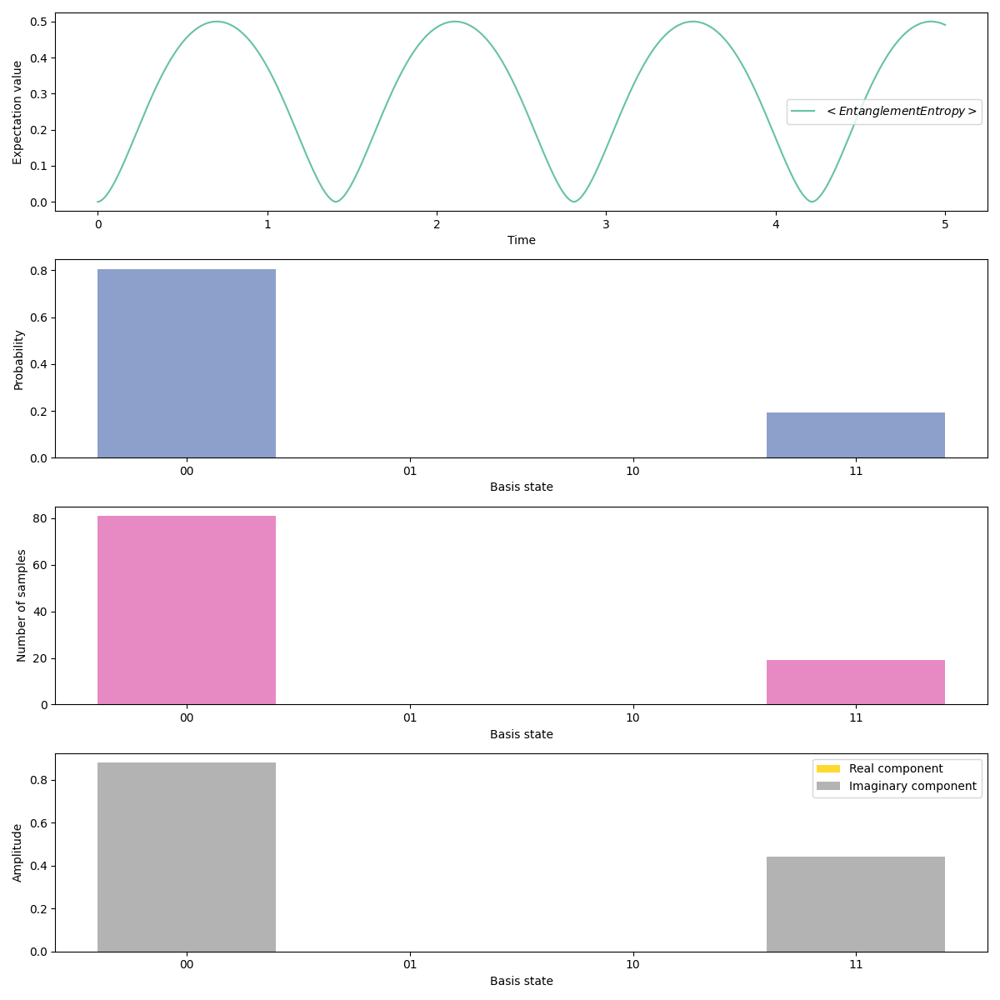

# Transverse field Ising model (TFIM)

Let's implement our favourite Hamiltonian -- the transverse-field Ising model.
The general Hamiltonian looks like,

$$
H = \sum_{\langle ij \rangle} \sigma^x_i \sigma^x_j + h \sum_i \sigma^z_i
$$

Let's implement it with two qubits and with $h=1$.

$$
H = \sigma^x_1 \sigma^x_2 + \sigma^z_1 + \sigma^z_2
$$

## Implementation

We will go through this step by step. First we get the necessary imports:
/// details | Imports

```py
from rich import print as pprint

import numpy as np

from midstack.interface.analog.operator import *
from midstack.interface.analog.operations import *
from midstack.backend.metric import *
from midstack.backend.task import Task, TaskArgsAnalog
from midstack.backend import QutipBackend

from examples.emulation.utils import plot_metrics_counts
```

///

Then we define the [`AnalogGate`][midstack.interface.analog.operations.AnalogGate] object

```py
"""For simplicity we initialize some Operators"""
X, Z, I = PauliX(), PauliZ(), PauliI()

H = AnalogGate(
    hamiltonian= (X @ X) + (Z @ I) + (I @ Z),
    dissipation=Dissipation(),
)
```

Then we define the [`AnalogCircuit`][midstack.interface.analog.operations.AnalogCircuit] object and evolve it according to the hamiltonian defined above

```py
circuit = AnalogCircuit()
circuit.evolve(duration = 5, gate = H)
```

For QuTip simulation we need to define the arguements which contain the number of shots and the metrics we want to evaluate.

```py
args = TaskArgsAnalog(
    n_shots=100,
    fock_cutoff=4,
    metrics={
        'entanglement_entropy': EntanglementEntropyVN(qreg = [1]),
    },
    dt=1e-2,
)
```

We can then wrap the [`AnalogCircuit`][midstack.interface.analog.operations.AnalogCircuit] and the args to a [`Task`][midstack.backend.task.Task] object and run using the QuTip backend. Note that there are 2 ways to run and the 2 ways are explained.

## Running the simulation

First initialize the [`QutipBackend`][midstack.backend.qutip.base.QutipBackend] object.
=== "Compile & Simulate"
The [`Task`][midstack.backend.task.Task] can be compiled first to a [`QutipExperiment`][midstack.backend.qutip.interface.QutipExperiment] object and then this [`QutipExperiment`][midstack.backend.qutip.interface.QutipExperiment] object can be run. This is to allow you to see what parameters are used to specify the particular QuTip experiment.

    ``` py
    backend = QutipBackend()
    experiment = backend.compile(task = task)
    results = backend.run(experiment = experiment)
    ```

=== "Directly Simulate"
The [`Task`][midstack.backend.task.Task] object can be directly simulated by the `run()` method.

    ``` py
    backend = QutipBackend()
    results = backend.run(task = task)
    ```

## Results

Finally we can plot the metrics and relevant statistics from the final quantum state:

```py
plot_metrics_counts(
    results = results,
    experiment_name = "tfim_2_site.png",
)
```

The generated image is like:

<!--   -->


